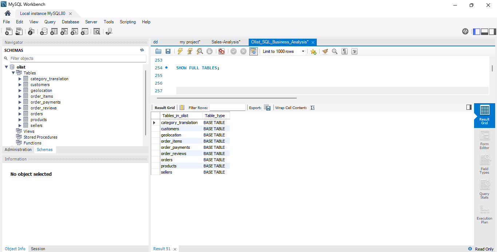
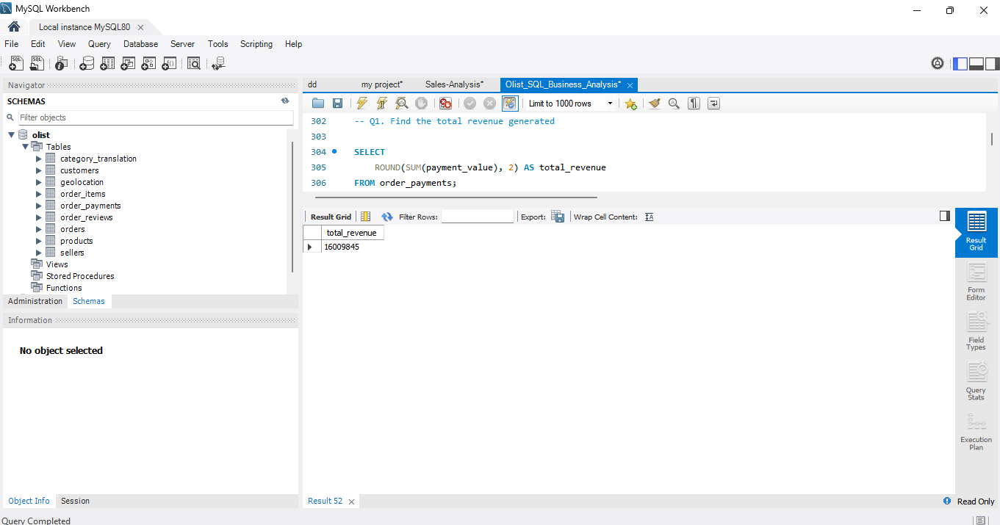
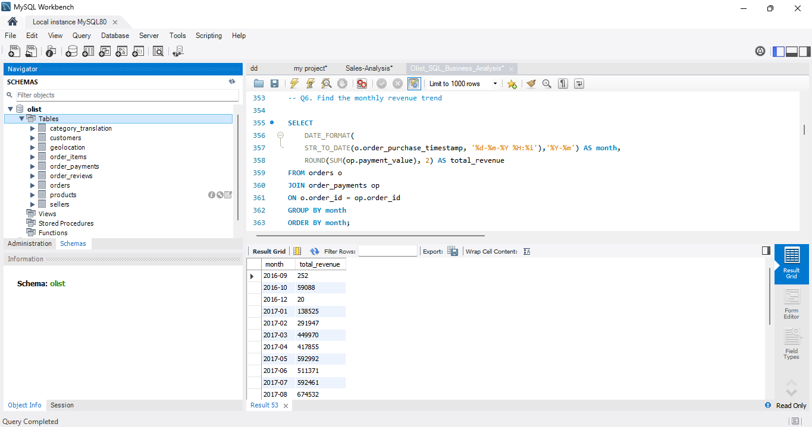
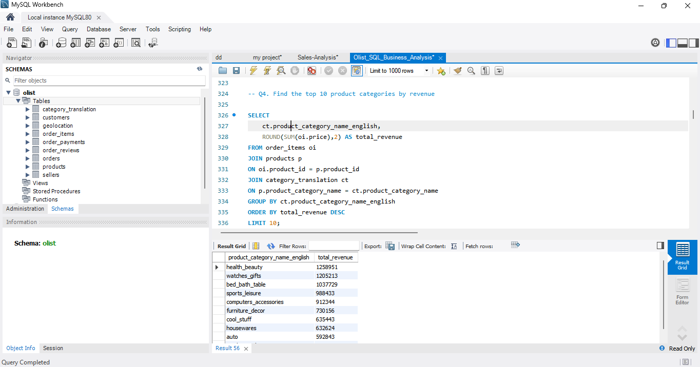
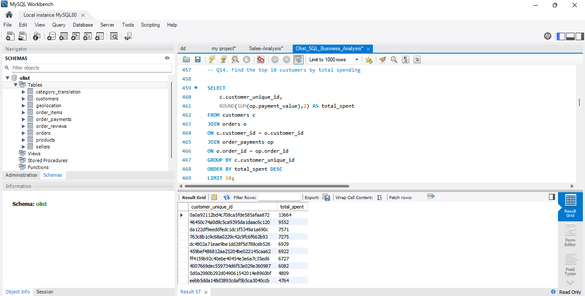
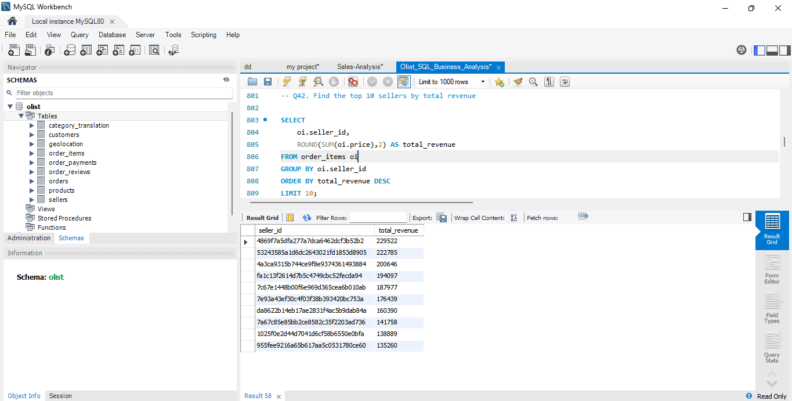
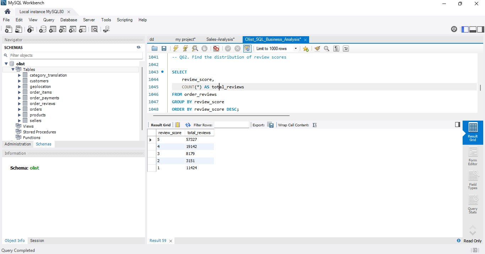
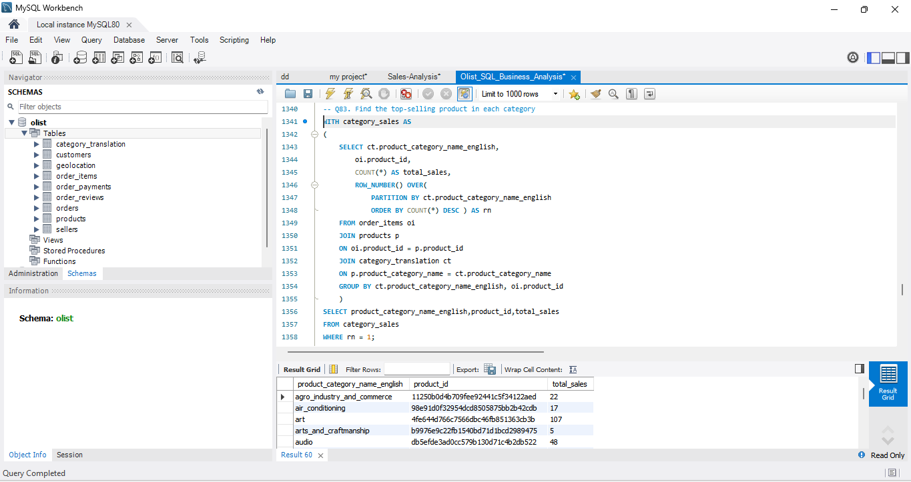

# 📊 Olist SQL Business Analysis

An end-to-end SQL Business Analysis project using the **Olist Brazilian E-Commerce Dataset**. This project demonstrates SQL skills by solving **100 real-world business questions** using MySQL.

---

# 📌 Project Overview

This project analyzes sales, customers, products, payments, sellers, deliveries, and customer reviews using SQL.

The analysis was performed using MySQL and includes:
- Sales Analysis
- Customer Analysis
- Product Analysis
- Payment Analysis
- Seller Analysis
- Delivery & Logistics Analysis
- Customer Review Analysis
- Advanced SQL Analysis
- Window Functions
- Common Table Expressions (CTEs)

---

# 📂 Dataset

**Dataset:** Olist Brazilian E-Commerce Public Dataset

The dataset contains information about:

- Customers
- Orders
- Order Items
- Products
- Sellers
- Payments
- Reviews
- Geolocation
- Product Category Translation

---

# 🛠 Tools Used

- MySQL 8.0
- MySQL Workbench
- SQL
- Git
- GitHub

---

# 📈 Business Questions Covered

This project answers **100 business questions** including:

- Total Revenue
- Monthly Revenue Trend
- Top Product Categories
- Top Customers
- Seller Performance
- Payment Analysis
- Delivery Performance
- Customer Reviews
- Customer Spending
- Advanced SQL Business Insights

---

# 📸 Project Screenshots

## 1️⃣ Database Tables



---

## 2️⃣ Total Revenue



---

## 3️⃣ Monthly Revenue Trend



---

## 4️⃣ Top Product Categories



---

## 5️⃣ Top Customers



---

## 6️⃣ Seller Analysis



---

## 7️⃣ Review Analysis



---

## 8️⃣ Advanced SQL (CTE & Window Function)



---

# 💡 Key Insights

- Identified the total revenue generated from all completed orders.
- Analyzed monthly sales trends to understand business growth.
- Identified the highest revenue-generating product categories.
- Found the top customers based on total spending.
- Evaluated seller performance using revenue generated.
- Analyzed customer review score distribution.
- Applied CTEs and Window Functions to solve advanced business problems.

---

# 🚀 SQL Skills Demonstrated

- SELECT
- WHERE
- GROUP BY
- ORDER BY
- HAVING
- LIMIT
- INNER JOIN
- LEFT JOIN
- Aggregate Functions
- Date Functions
- CASE WHEN
- Subqueries
- Common Table Expressions (CTEs)
- Window Functions
- ROW_NUMBER()
- RANK()
- DENSE_RANK()
- LAG()
- LEAD()

---

# 📁 Repository Structure

```
Olist_SQL_Business_Analysis
│
├── Images
│   ├── 01_database_tables.png
│   ├── 02_total_revenue.png
│   ├── 03_monthly_revenue_trend.png
│   ├── 04_top_product_categories.png
│   ├── 05_top_customers.png
│   ├── 06_seller_analysis.png
│   ├── 07_review_analysis.png
│   └── 08_advanced_sql.png
│
├── Olist_SQL_Business_Analysis.sql
└── README.md
```

---

# ⭐ Project Highlights

- ✅ 100 SQL Business Questions
- ✅ Real-world E-Commerce Dataset
- ✅ Business-Oriented SQL Analysis
- ✅ Advanced SQL Queries
- ✅ CTEs
- ✅ Window Functions
- ✅ Professional GitHub Documentation

---

# 👨‍💻 Author

**Sanjith Gowda B K**

GitHub: https://github.com/Sanjith9876
